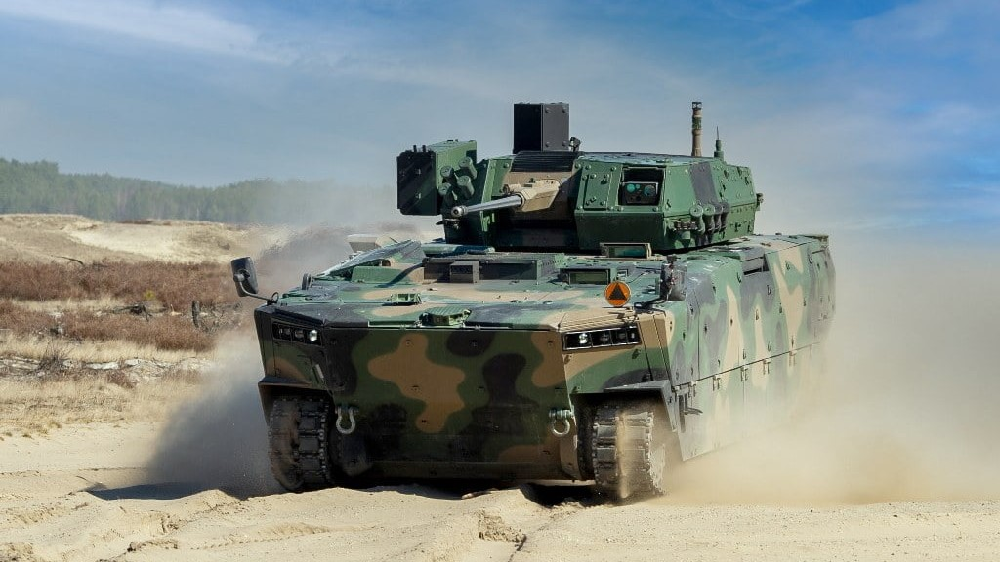

# Technical tour

The 2023 16th European-African Regional Conference of the International Society for Terrain-Vehicle Systems (ISTVS) will conduct a technical tour at [the Military Institute of Armored and Automotive Technology (MIAAT)](https://witpis.pl/english-2/witpis-home-cloned/) located at the Sulejówek, near Warsaw.

The tour will include a short presentation, visiting outdoor laboratories, and a presentation of test stands and vehicles. The tour will be followed by a visit to [Kazimierz Dolny](https://www.kazimierz-dolny.pl/), with an opportunity for sightseeing and dinner in a restaurant.

<figure><figcaption></figcaption></figure>

> The Military Institute of Armored and Automotive Technology (MIAAT) is a facility where research and development projects are conducted to improve the quality and functionality of vehicles, military equipment and armaments of the Polish Army.

<figure><figcaption>
SANP
</figcaption></figure>

 

<figure><figcaption>
BORSUK
</figcaption></figure>

> MIAAT conducts research and tests of vehicles implemented in the Polish Armed Forces and participates in the process of their modernization. Meeting the growing demand for new technologies, the Institute is involved in research, the results of which carry considerable potential for implementation and innovation. Performing work in the area of research, development and implementation of military and civilian equipment, the Institute participates in many key R\&D project on a national and international scale.
>
> The Institute has three accredited laboratories, a Product Certification Unit, an Expert Office and, above all, qualified staff, which allows to cooperate with many universities in terms of research projects, joint publications and the development of scientific staff.\
> \- MIIAT website

### Schedule for October 13, 2023

7.30 Departure from Lublin\
10.00 [MIAAT Sulejówek](https://witpis.pl/english-2/witpis-home-cloned/)\
13.00 Refreshments\
14.00 Departing from Sulejówek\
15.30 [Kazimierz Dolny](https://www.kazimierz-dolny.pl/), lunch in a restaurant\
16.00 Visiting Kazimierz Dolny\
18.00 Departing for Lublin

### Registration details

For registered conference attendees, the cost to attend the technical tour is included in your registration fee. However, you must submit a scanned passport or identity card (for EU countries citizens) together with the Technical Tour Registration form which includes all the required personal information to conduct the necessary background check to receive authorization to attend.&#x20;

**Please take notice of the submission deadlines for the technical tour registration. Attendees who do not submit all required information on time will not be authorized to attend the tour, and final authorization is subject to successful background checks. The MIAAT reserves the right to reject and decline visitor requests.**

1. _Foreign Nationals (Non-Polish citizens)_ must submit their technical tour registration information together with scanned passport or Identity Card—only for European Union countries citizens, not later than 15 September 2023 and they must also be a registered conference attendee at the time of submission.
2. _Poland‘s citizens_ must submit their technical tour registration information together with scanned Identity Card not later than 15 September 2023 and they must also be a registered conference attendee at the time of submission.
3. _Accompanying guests_ to the conference attendees are also allowed to join the technical tour, providing they also submit their own technical tour registration form together with scanned passport or ID-card.&#x20;

#### Technical Tour Additional Information&#x20;

The technical tour to MIAAT facilities will take place on Friday, 13 October 2023.&#x20;

Registered tour attendees will meet outside (east gate) the RUSTY-Building on the campus of the Lublin University of Technology at 7:15 and board buses for transportation to MIAAT facilities. Buses depart from RUSTY promptly at 7:30.&#x20;

Upon completion of the tour at MIAAT, the buses will transfer attendees to Kazimierz Dolny for lunch and visiting the city. After visiting Kazimierz Dolny, buses will return attendees to Lublin, finishing the ride at RUSTY-Building of the LUT.

### Registration form




_Note that you will not receive a confirming tour registration email._

