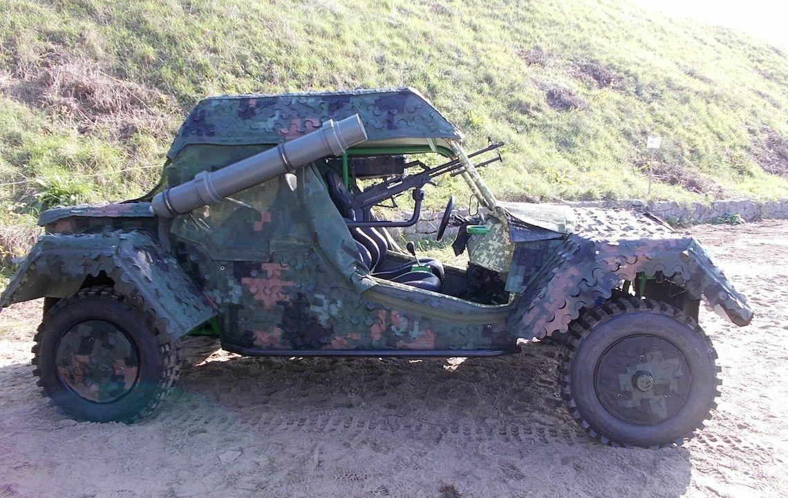

# Program overview

## Preconference | 10. October 2023

10.00 – 15.00 | [Pre-Conference Professional Short Course](program-overview.md#preconference-or-10.-october-2023), Room M107

14.00 – 17.00 | ISTVS Board of Directors Meeting, Room _tbd_

18.00 – 21.00 | Ice Breaker Welcome Event, [Hotel Ibis Styles](https://ibislublin.pl/hotel/o-hotelu) (15 mins by bus)

## Conference Day 1 | 11. October 2023

8.00 | Registration

9.00 | Opening  ceremony, Auditorium A1\
Conference Chair Welcome — Jarosław Pytka\
President’s Address — Corina Sandu\
Journal of Terramechanics Editor-in-Chief’s Address — Vladimir Vantsevich

10.00 | Plenary Session, Auditorium A1\
**Keynote: Prof. Jerzy Lipiec, Institute of Agrophysics, Poland**\
_Vehicular traction effects on agriculture: Soil compaction and soil erosion, crop yield._ \
_Implications from the perspective of terramechanics_

12.00 | Conference photo followed by lunch

13.00 | Parallel sessions — 2 tracks — Auditorium A2/A3/M107

14.30 | Refreshments

15.00 | Parallel sessions — 2 tracks — Auditorium A2/A3/M107

16.30 | Refreshments

17.00 | LUT Off-Road and Military Vehicle Students‘ Projects — Workshop, Prof. L. Gardyński

## Conference Day 2 | 12. October 2023

9.00 | Plenary session, Auditorium A1\
**Keynote: Dr. Vassilios Papantoniou, Hellenic Technology of Robotics, Greece**\
_A novel flexible all-metal wheel for planetary exploration_

10.00 | Refreshments

10.30 | Parallel sessions — 2 tracks — Auditorium A2/A3/M107

12.00 | Lunch

13.00 | Parallel sessions — 2 tracks — Auditorium A2/A3/M107

14.30 | Refreshments

15.00 | Parallel sessions — 3 tracks — Auditorium A2/A3/M107

16.30 | Closing ceremony and awards

19.00 | Gala dinner — [Hotel Ibis Styles](https://ibislublin.pl/hotel/o-hotelu)

## Conference Day 3 | 13. October 2023

[Technical Tour — Sulejówek](../conference/technical-tour.md)

7.30 | Departure

10.00 | [WITPIS Sulejówek](https://www.witpis.eu/pl/)

13.00 | Refreshments

14.00 | Departing from Sulejówek

15.30 | [Kazimierz Dolny](https://www.kazimierz-dolny.pl/turystyka/), lunch in a restaurant

16.00 | Visiting Kazimierz Dolny

18.00 | Departing for Lublin

## Student Projects Workshop

Hands-on demonstrations of Lublin University of Technology student projects in off-road and military vehicles will be ongoing through the conference. Here are a few examples. [See all the projects that will be on display](student-projects.md).

### Off-Road and Military Vehicles | Lublin University of Technology

<figure><figcaption>
<strong>BUGGY 4x4.</strong> A prototype of a light off-road vehicle with improved trafficability and versatile use proposed by the Lublin University of Technology for the army and public order services.
</figcaption></figure>

 

<figure><figcaption>
<strong>ŻUK 6x6.</strong> A small tipper with all-wheel drive and the possibility of configuring the drive 6x2, 6x4, and 6x6. Has a cab that opens like in larger trucks and other improvements for off-road use.
</figcaption></figure>

 

<figure><figcaption>
<strong>HYBRID POLONEZ</strong> Students installed an additional axle. Steel tracks are mounted on the wheels of the two rear axles and skids on the front axle wheels, thanks to which the vehicle is able to overcome snowy areas.
</figcaption></figure>

