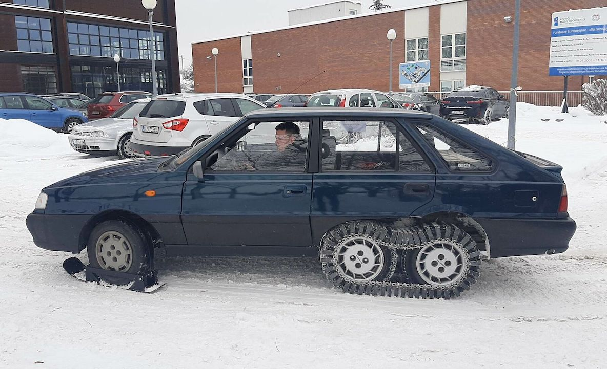

# Overview

## Preconference | 10. October 2023

10.00 – 15.00 | [Pre-Conference Professional Short Course](program-overview.md#preconference-or-10.-october-2023), Room M107, R302

14.00 – 17.00 | ISTVS Board of Directors Meeting, Room M107

18.00 – 21.00 | Ice Breaker Welcome Event, [Hotel Ibis Styles](https://ibislublin.pl/hotel/o-hotelu) (15 mins by bus)

## Conference Day 1 | 11. October 2023

8.00 | Registration

9.00 | Opening  ceremony, Auditorium A1\
Conference Chair Welcome — Jarosław Pytka\
President’s Address — Corina Sandu\
Journal of Terramechanics Editor-in-Chief’s Address — Vladimir Vantsevich

10.00 | Plenary Session, Auditorium A1\
**Keynote: Prof. Jerzy Lipiec, Institute of Agrophysics, Poland**\
_Vehicular traction effects on agriculture: Soil compaction and soil erosion, crop yield._ \
_Implications from the perspective of terramechanics_

12.00 | Conference photo followed by lunch

13.00 | Parallel sessions — 3 tracks — Auditorium M107/CT302/R302



**Chair: Dr Lutz Richter**

**Room: M107**

0274 / _Deep learning method for IMU-based tracking of Martian rover_

0709 / _Proposal of swarm rovers’ collaborative locomotion with expansion and contraction mechanism for driving a loose slope_

0889 / _Skidding suppression method using “discrete 4-wheel-drive typed rover” considering steering angle at traveling across loose slope_

1453 / _Suppressing the reduction of the traveling displacement on loose soil for rovers with the function of a wheel walking_

2765 / _Obstacle detection vision system enabling autonomous mounding on clearcuts_



**Chair: TBA**

**Room: CT302**

2177 / _Effects of road wheel load, driving speed and track slip upon stress state in sandy soil under tracked vehicle loading_

2297 / _Traction effects on vertical and horizontal contact stresses and the risk of soil structure deformation_

3797 / _Disturbed and naturally recovered soil surface as a ground for subsequent vehicle mobility operations_

4895 / _Theoretical analysis and fem simulation of the interfacial forces between tracked vehicle and snow soil_

6690 / _Comparative evaluation of methods to evaluate penetration resistance for Clegg hammer and cone penetrometer_



**Chair: Prof. Schalk Els**

**Room: R302**

3859 / _Analysis for dynamic characteristics of a tractor cabin during agricultural operations_

4141 / _Modeling and verification of a full-scale forestry vehicle real-time multi-physics digital twin_

5356 / _Development and validation of head-feeding combine harvester multibody dynamics simulation model_

6955 / _Development of dynamics simulation model for agricutural tractor according to agricultural work_

7198 / _Analysis of aircraft dynamics while overcoming obstacles on a grass runway_

8963 / _Analysis of the influence of terrain unevenness and velocity on the ground pressure_



14.30 | Refreshments

15.00 | Parallel sessions — 3 tracks — Auditorium M107/CT302/R302



**Chair: Prof. Genya Ishigami**

**Room: M107**

6027 / _Digital precision planning tool for autonomous forest regeneration of mixed tree species_

8151 / _Study on estimation of traveling states using strain information on chassis of lunar and planetary exploration rovers_

8672 / _Trajectory optimization for vegetation override in off-road driving_

2145 / _Obstacle performance and wheel failure test analysis of Zhurong rover_

4976 / _Performance evaluation of autonomous driving lateral control simulation model of agricultural tractor_



**Chair: Prof. Rafał Longwic**

**Room: CT302**

4816 / _Effects of humidity on the emissions of the diesel engines_

7477 / _Evaluating the pressure performance of DPF filters using engine bench analysis_

1166 / _Selection of energy saving engine mode based on the power delivery and fuel consumption of a 95-kW tractor during agricultural operations_

4727 / _Analysis of gear durability for agricultural tractor transmission_



**Chair: Prof. Peter Kiss**

**Room: R302**

2437 / _Improving predictive control methods on off-road vehicles with realistic steering preview inputs_

3815 / _Data measurement and performance evaluation of an electric all-wheel-drive tractor during plow tillage_

3893 / _Analysis of load factor and performance evaluation for developing an electric driven tractor_

8254 / _Characterization of the new US army cold weather all-terrain vehicle (CATV) on winter surfaces_



16.30 | Refreshments

17.00 | LUT Off-Road and Military Vehicle Students‘ Projects — Workshop, Prof. L. Gardyński

## Conference Day 2 | 12. October 2023

9.00 | Plenary session, Auditorium A1\
**Keynote: Mr. Stelios Skevakis, Hellenic Technology of Robotics, Greece**\
_A novel flexible all-metal wheel for planetary exploration_

9.45 | Plenary session, Auditorium A1\
**Keynote: Dr Andrzej Selenta, Warsaw University of Technology, Poland**\
_The Bekker Project_

10.30 | Parallel sessions — 3 tracks — Auditorium M107/CT302/R302



**Chair: Prof. Corina Sandu**

**Room: M107**

6211 / _Wheel-soil terramechanics model augmentation using machine learning across multiple soil types_

1522 / _Tractive performance of rigid wheel in granular media using coarse-scale DEM models_

6143 / _Flexible tire-terrain interaction model for real time simulations_

3835 / _Effect of steer angle rate upon tyre lateral force generation on two different soils_

4508 / _Semi-empirical terramechanics model for variable terrain height_



**Chair: Prof. Peter Kiss**

**Room: CT302**

1098 / _Simulation of change in supporting force when imparting vibration by distinct element method_

2801 / _In Situ Soil Property Estimation for Autonomous Earthmoving Using Physics- Infused Neural Networks_

&#x20;4336 / _High-fidelity 3D-DEM simulation for wheel mobility in low gravity environment_

&#x20;4456 / _Modeling soil-tool interaction of a cultivator sweep using DEM_



**Chair: Prof. Jerzy Józwik**

**Room: R302**

1638 / _Analysis of tire characteristics on road surface with volcanic ash fall_

1779 / _The development of a dynamic vegetation override pushbar for autonomous ground vehicles_

4595 / _Evaluation and comparison of driving performance of a lunar exploration rover wheel in different soils_

5552 / _Vehicle drawbar test method with improved measurement and contro_l

6861 / _Researches on airplane performance on a grass airfield_



12.00 | Lunch

13.00 | Parallel sessions — 2 tracks — Auditorium M107/R302



**Chair: Prof. Jozsef Koveceses**

**Room: M107**

3796 / _The issue of assessing the suitability of own simulation models for testing off-road vehicles_

6736 / _Ride comfort comparison between 4-poster and straight line driving simulations_

0448 / _Lunar rover discrete element method study and calibration_

8859 / _An efficient and high-fidelity track model for dynamic simulation of off-road tracked vehicles_

4681 / _Simplified models of terrain-vehicle interaction for real-time applications_



**Chair: TBA**

**Room: R302**

2936 / _Moisture content impacts on soil load bearing capacity and its spectral behaviour_

3493 / _Numerical modeling of a tire on undrained saturated clay using FEM, ALE, and SPH_

9992 / _Soil shear strength values obtained from its colour_

7577 / _Implementation of moving loads on ice in NRMM_

1805 / _Accelerating graph networks for real-time physics simulations_



14.30 | Refreshments

15.00 | Parallel sessions — 2 tracks — Auditorium M107/R302



**Chair: Dr Loraine ten Damme**

**Room: M107**

7523 / _Assessing performance of light wheeled vehicles on GRC-1 using 3D scanned footprint measurements_

8754 / _Characterization of lunar simulant (FJS-1), toyoura sand, and silica sand with physical experiments and dem simulation_

9504 / _Soil deformation model for efficient simulation of off-road vehicles and compaction force analysis_

3507 / _Determination of the tractive forces of a tractor based on the reconstruction of tire – soil contact surface obtained by means of photogrammetry_

6630 / _Real-time measurement of tire sinkage using stereo cameras_



**Chair: TBA**

**Room: R302**

3280 / _Comparison of tweels and pneumatic tires on LTATV military vehicle_

6059 / _Comparison of multi-tracked running gears for light UGVs in terms of terrain obstacles overcoming abilities_

&#x20;7994 / _Longitudinal friction coefficient comparison on actual and laboratory surfaces_

&#x20;9268 / _Experiments of singkage characters of wire mesh wheel under different slip ratio_

&#x20;9716 / _Non-pneumatic tire for special vehicle – a review of selected functional properties_



16.30 | Closing ceremony and awards

19.00 | Gala dinner — [Hotel Ibis Styles](https://ibislublin.pl/hotel/o-hotelu)

## Conference Day 3 | 13. October 2023

[Technical Tour — Sulejówek](../conference/technical-tour.md)

7.30 | Departure

10.00 | Arrival at [WITPIS Sulejówek](https://www.witpis.eu/pl/)

10.15 | Welcome by MIAAT officer and a short presentation of the programme

10.20 | Presentation of the Institute (indoor)

10.35 | Presentation of the laboratories (outdoor/indoor, talk to test engineers/researchers)

11.30 | Test-show of military vehicles: Jelcz, Tareo, Rosomak (outdoor, in action)

13.00 | Refreshments (Military pea soup + coffee/tea)

13.30 | End and farewell to the participants of the trip

14.00 | Departing from Sulejówek

15.30 | [Kazimierz Dolny](https://www.kazimierz-dolny.pl/turystyka/), lunch in a restaurant

16.00 | Visiting Kazimierz Dolny

18.00 | Departing for Lublin

## Student Projects Workshop

Hands-on demonstrations of Lublin University of Technology student projects in off-road and military vehicles will be ongoing through the conference. Here are a few examples. [See all the projects that will be on display](student-projects.md).

### Off-Road and Military Vehicles | Lublin University of Technology

<figure><figcaption>
<strong>BUGGY 4x4.</strong> A prototype of a light off-road vehicle with improved trafficability and versatile use proposed by the Lublin University of Technology for the army and public order services.
</figcaption></figure>

 

<figure><figcaption>
<strong>ŻUK 6x6.</strong> A small tipper with all-wheel drive and the possibility of configuring the drive 6x2, 6x4, and 6x6. Has a cab that opens like in larger trucks and other improvements for off-road use.
</figcaption></figure>

 

<figure><figcaption>
<strong>HYBRID POLONEZ</strong> Students installed an additional axle. Steel tracks are mounted on the wheels of the two rear axles and skids on the front axle wheels, thanks to which the vehicle is able to overcome snowy areas.
</figcaption></figure>

