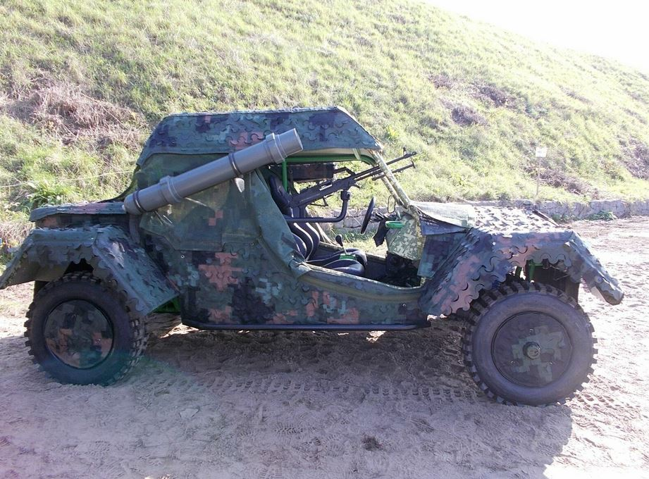

# Student projects

<figure><figcaption>
BUGGY 4x4. A prototype of a light off-road vehicle with improved trafficability and versatile use proposed by the LUT for the army and public order services.
</figcaption></figure>
