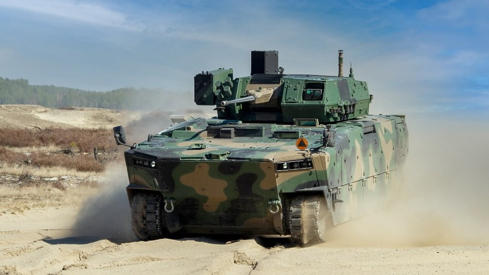

# Technical tour

The 2023 16th European-African Regional Conference of the International Society for Terrain-Vehicle Systems (ISTVS) will conduct a technical tour at [the Military Institute of Armored and Automotive Technology (MIAAT)](https://witpis.pl/english-2/witpis-home-cloned/) located at the Sulejówek, near Warsaw.

<figure><figcaption></figcaption></figure>

The Military Institute of Armored and Automotive Technology (MIAAT) is a facility where research and development projects are conducted to improve the quality and functionality of vehicles, military equipment and armaments of the Polish Army.

<figure><figcaption>
SANP
</figcaption></figure>

 

<figure><figcaption>
BORSUK
</figcaption></figure>

MIAAT conducts research and tests of vehicles implemented in the Polish Armed Forces and participates in the process of their modernization. Meeting the growing demand for new technologies, the Institute is involved in research, the results of which carry considerable potential for implementation and innovation. Performing work in the area of research, development and implementation of military and civilian equipment, the Institute participates in many key R\&D project on a national and international scale.\
The Institute has three accredited laboratories, a Product Certification Unit, an Expert Office and, above all, qualified staff, which allows to cooperate with many universities in terms of research projects, joint publications and the development of scientific staff.\
The tour will include a short presentation, visiting outdoor laboratories, and a presentation of test stands and vehicles. The tour will be followed by a visit to [Kazimierz Dolny](https://www.kazimierz-dolny.pl/), with an opportunity for sightseeing and dinner in a restaurant.

### Schedule for October 13, 2023

7.30 Departure from Lublin

10.00 MIAAT Sulejówek

13.00 Refreshments

14.00 Departing from Sulejówek

15.30 Kazimierz Dolny, lunch in a restaurant

16.00 Visiting Kazimierz Dolny

18.00 Departing for Lublin
